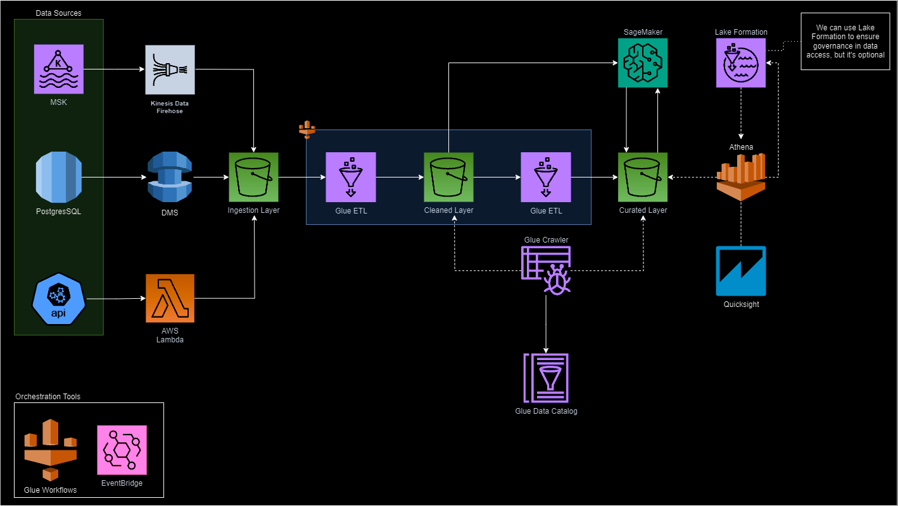

# AWS Architecture

## Data ingestion

### Kafka
For Kafka, we can use Kinesis Data Firehose, which, since the second half of 2023, allows data to be deposited in object storage in the Parquet format, provided that the Kafka source is an AWS MSK (Managed Streaming for Kafka). If Kafka is not an MSK, we can use Spark Streaming to persist this data in ingestion or even Lambda Functions.

### Postgres

The Data Migration Service (DMS) is an excellent option for ingesting data in the ingestion layer. For cases where we need more freshness, we can employ the change data capture strategy to capture only the changes that occurred in the last hour after the ingestion data load.  
DMS has a feature for capturing data change in ongoing replication. Still, for situations where there is no need to capture this change continuously, we can use Event Bridge scheduling to orchestrate full-load or ongoing replication tasks once a week.

### Web API
We can use EventBridge along with Lambda functions to perform ingestion from API calls. If more robustness is needed, we can use S3 landing events as triggers for Lambda Function's execution.

## Processing
The choice of Glue was due to its simplicity and cost-effectiveness for some lower-volume and less frequent tasks, as there is no need to manage an Apache Spark cluster to execute the jobs. The scheduler for these jobs is the built-in workflow tool in AWS Glue. Additionally, AWS Identity and Access Management (IAM) is required to grant access to the physically stored data and/or cataloged tables.

#### Ingestion layer
All the chosen ingestion options can write files in Parquet format, and they should do so. In this context, the only access that should occur is from the jobs responsible for cleaning and landing these data into the cleaned layer.

#### Cleaned layer
After inserting the data into the ingestion layer, we can clean data anomalies and standardize column names, landing this data in delta format in the cleaned layer. Additionally, there is the option to use Glue Data Quality to ensure that the data in this layer is free of anomalies and reliable. This layer can also serve ML models.

#### Curated layer
This layer is designed to store data for consumption, suitable for analytical dashboards and data explorers. It can also be fed by predictive model data. The storage strategy continues to be in the modern Delta table format, preferably for aggregated data.

## Data Catalog
The choice of the Glue Data Catalog is driven by simplicity; using the Glue Crawler, metadata exploration, and cataloging can be done relatively easily. The decision to catalog was made only for layers where there is confidence in the data and it can be accessed. For this reason, the first layer is excluded from the catalog.

## Data consumption and visualization
Data exploration can be done through Quicksight, using Athena as the engine, enabling queries on Delta tables cataloged in the Glue Catalog. There's also the option to use Lake Formation to ensure data governance, provided that the table is registered in Lake Formation as well.

## Modeling
SageMaker handles the end-to-end model lifecycle, which utilizes data from the staging and analytics layers to train models, potentially feeding into the analytics layer with features, model metrics, or prediction data.
